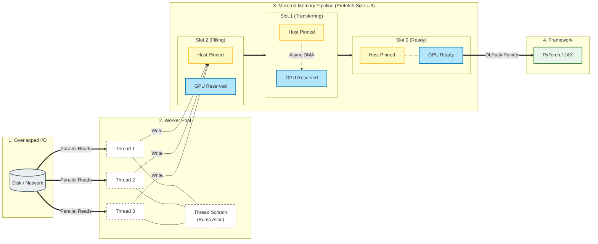

# Native Dataloader

**A modular, high-performance C++20 data engine for Python deep learning.**

Native Dataloader replaces the standard Python-based data loading pipeline with a compiled, asynchronous C++ engine. It is designed for **predictability**: ensuring that data loading never causes memory spikes or thread contention that could interfere with your deep learning framework.

By moving the entire ETL (Extract, Transform, Load) pipeline outside the Python GIL and managing memory statically, it allows modern GPUs to consume data at their theoretical hardware limits via zero-copy DLPack transfers.

---

## 🚀 Key Features

*   **Zero-Copy Handover:** Outputs tensors via **DLPack**, enabling instant integration with **JAX** and **PyTorch** without data duplication.
*   **Asynchronous Pipeline:** Decoupled I/O, decoding, augmentation, and GPU transfer stages.
*   **Pinned Memory Management:** Custom allocators ensure data is decoded directly into pinned (page-locked) memory.
*   **SIMD Accelerated Compression:** A custom **lossless** `.compressed` format pipeline optimized using AVX2 intrinsics.
*   **Strict C++20 Implementation:** Built for stability using modern concurrency primitives (`std::latch`, `std::atomic`, `std::barrier`).

---

## 🧠 Architecture: Static Memory & The Resource Pool

Deep learning frameworks are extremely sensitive to resource contention. A sudden `cudaMalloc` or `pthread_create` in the middle of a training loop can cause frame jitters or OOM crashes.

Native Dataloader eliminates this volatility via the **Global Resource Pool**:

### 1. The Global Mirrored Allocator
To hide PCIe latency, the Resource Pool manages a global, fixed-size arena of **Mirrored Memory**.
*   For every buffer allocated on the Host (CPU Pinned Memory), a corresponding buffer is pre-allocated on the Device (GPU).
*   Transfers are initiated asynchronously using CUDA fences.
*   The consumer receives a `DLManagedTensor` pointing to this pre-allocated GPU memory.
*   Data loaders reuse the global resource pool. So switching from one data loader to another with the same or lower memory requirements, say train to validation, does not trigger new allocations or temporary spikes in usage.

### 2. Thread-Local Static Scratch
Unlike Python loaders that churn RAM, our worker threads operate on **Static Scratch Buffers**.
*   Before the loader starts, every component (Decoder, Augmenter) reports its *maximum theoretical memory requirement* (e.g., "I need 40MB for the largest possible JPEG in this dataset").
*   The Resource Pool allocates these scratch buffers **once per thread**.
*   During the training loop, threads use simple **Bump Allocators** (resetting offset to 0) to utilize this memory.
*   **Result:** Zero dynamic `malloc`/`free` calls for large buffers during training. For now, insignificant allocations are still going on like `std::string`.

### 3. Thread Stability
The Resource Pool maintains a fixed set of worker threads. When switching dataloaders (e.g., Train → Val), we use a **Generational Index** to cleanly "flush" old tasks and assign new ones without killing or recreating threads, preserving OS scheduler stability.

### 4. Data Flow Visualisation


---

## 🏗️ Modular Components

The engine is built on strict C++ interfaces. You can mix, match, or extend these components via `pybind11`.

### Data Sources (`IDataSource`)
*The Discovery Layer.*
*   **`FlatDataSource`:** Recursively scans directories for files.
*   **`WebDataset`:** (Planned) offsets into TAR archives.
*   **Custom:** Implementable in C++.

### Data Decoders (`IDataDecoder`)
*The Parsing Layer.*
Decoders are probed automatically based on file content.
*   **`JpgDataDecoder`:** High-performance decoding via `libjpeg-turbo`.
*   **`PngDataDecoder`:** Lossless decoding via `libpng`.
*   **`ExrDataDecoder`:** Floating-point HDR decoding via `OpenEXR` and `Imath`.
*   **`NpyDataDecoder`:** Standard numpy array loading via `cnpy`.
*   **`CompressedDataDecoder`:** Our custom high-bandwidth format.

### Augmentations (`IDataAugmentation`)
*The Math Layer.*
Augmentations transform the tensor *shape*. Others like color transforms should still happen on the GPU.
*   **`ResizeAugmentation`**: Bilinear interpolation.
*   **`PadAugmentation`**: Padding with configurable alignment (Top-Left, Bottom-Right, etc.).
*   **`RandomCropAugmentation`**: Deterministic cropping based on item seeds.
*   **`FlipAugmentation`**: Horizontal/Vertical flips.

---

## 💾 Deep Dive: The Compression Pipeline

Standard image formats (JPEG/PNG) are CPU-heavy to decode, and standard compression (GZIP) works poorly on floating-point tensors.

We implement a custom `.compressed` format optimized for **lossless throughput**. The pipeline runs on the CPU but is designed to saturate disk bandwidth. 

**The Pipeline Steps:**
1.  **FP16 Cast (Optional):** Reduces bandwidth by 50% with minimal precision loss. *This is the only lossy step.*
2.  **Bitshuffle (AVX2):** Floating point data has high entropy in the mantissa but low entropy in the exponent. We transpose the data block at the bit level, creating long runs of zeros.
3.  **Dimensional Permutation:** We permute dimensions (e.g., `HWC` -> `CHW`) to align features in memory, optimizing the look-ahead for the compressor.
4.  **ZSTD:** Finally, the reordered bitstream is compressed with Zstandard (Level 3, 7, or 22).

*Result:* Smaller file sizes than raw binary float tensors and fast decoding speeds.

### Compression Example

You can compress your raw numpy arrays (`.npy`) into this format ahead of time:

```python
import native_dataloader as ndl

options = ndl.CompressorOptions(
    num_threads=16,
    input_directory="data/raw_features",
    output_directory="data/compressed_features",
    shape=[300, 300, 32], # H, W, C
    cast_to_fp16=True,    # Set to False for fully lossless mode
    permutations=[[0, 1, 2], [2, 0, 1]], # Auto-select best permutation
    with_bitshuffle=True,
    allowed_codecs=[ndl.Codec.ZSTD_LEVEL_3],
    tolerance_for_worse_codec=0.01
)

# Starts the C++ compression engine
compressor = ndl.Compressor(options)
compressor.start()
```

---

## ✨ Integrated Spatial Augmentation System

Native Dataloader enforces **Spatial Consistency** between inputs (images) and targets (masks, keypoints) using a strongly-typed `ItemType` system:

*   **`ItemType.RASTER` (Anchor):** The primary image. When augmented (e.g., Random Crop), the system records the exact parameters used in a **Processing Schema**.
*   **`ItemType.POINTS` (Follower):** Spatial data (keypoints, boxes). These items automatically reference the preceding Raster's schema. If the image is flipped/cropped, the points are mathematically transformed to match.
*   **`ItemType.NONE` (Invariant):** Labels or metadata. These bypass spatial augmentations entirely.

---

## 🛠️ Installation & Build

This project relies on `uv` for Python dependency management and `CMake` with `Ninja` for the C++ build.

### Prerequisites
*   C++20 compatible compiler (GCC/Clang)
*   CUDA Toolkit
*   Python 3.9+
*   `uv`

### Setup

```bash
# 1. Install dependencies and setup virtual environment
uv sync

# 2. Build and install in Debug mode (for development)
make install-debug

# OR. Build and install in Release mode (maximum performance)
make install-release
```

---

## ⚙️ Configuration & Tuning

The `DataLoader` exposes critical parameters to tune the pipeline for your specific hardware constraints.

```python
loader = DataLoader(
    dataset=dataset,
    batch_size=128,   # Standard batch size
    num_threads=16,   # Number of C++ worker threads
    prefetch_size=4,  # Pipeline depth
    aug_pipe=aug_pipe
)
```

| Parameter | Impact | Description |
| :--- | :--- | :--- |
| `num_threads` | **CPU & Throughput** | The size of the C++ worker pool. Unlike Python loaders, increasing this does not spawn new processes. It should be tuned to match your CPU core count and IO/Decoding complexity. |
| `prefetch_size` | **GPU Memory** | The number of batches to prepare asynchronously ahead of time. Higher values hide latency better but linearly increase the reserved **VRAM**. |
| `batch_size` | **Training Dynamics** | Standard batch size. Note that changing this will trigger a Resource Pool generation change (flushing pipelines). |

**⚠️ Note on VRAM Usage:**
Because the dataloader uses **Mirrored Allocation**, it reserves GPU memory upfront based on this formula:
`Reserved VRAM ≈ batch_size * prefetch_size * max_item_size_bytes`
If you encounter OOM errors on the GPU, reduce the `prefetch_size`.

---

## 🛡️ Testing & Quality Assurance

The project maintains a comprehensive test suite covering correctness, memory safety, and concurrency.

[View Test Suite Summary](TESTS.md)

### Static Analysis & Sanitizers
Code correctness is enforced strictly through static analysis and runtime sanitizers.

*   **Static Analysis:** `clang-tidy` with `WarningsAsErrors` checks for concurrency issues, performance pitfalls, and modern C++ compliance.
*   **Runtime Sanitizers:** A dedicated `DebugAsanUsan` preset injects **AddressSanitizer (ASan)** and **UndefinedBehaviorSanitizer (UBSan)** to catch memory leaks, race conditions, and undefined behavior during tests.

```bash
# Run tests with Sanitizers enabled
make install-debug-asan-usan
./scripts/run_tests_with_san.sh
```

---

## ⚠️ Current Status & Stability

While this project allows for high-performance data loading, it is currently considered **Beta** software.

*   **Hardening:** The codebase is not yet 100% hardened. Some race conditions still exist and an hour-long stress test with many dataloader switches etc. is still missing and would likely fail at this moment in time.
*   **Missing Sanitization:** While we strictly enforce ASan and UBSan, **ThreadSanitizer (TSan) has not yet been integrated**. Also, a cuda-free backend is coming in future updates that will enable us to test the entire end-to-end dataloader with sanitizers, not just subunits like the compressor, augmentations and dataset.
*   **Multi GPU Training:** While the architecture supports multi-gpu training in principle, the ability is not yet integrated into the dataloader. This is very feasible though and is also coming in future updates.
*   **Network drives:** The `overlapped_io` implementation of the flat data source is still missing. In future updates, we will add a custom `FUSE` filesystem that emulates high latency network drives in testing. This will ensure input i/o is properly pipelined with the decode/augment computations. For now, this is not supported.
*   **Auto-tuning:** To get the most performance out of the dataloader, we will add an automatic tuning utility that will tune the data source (e.g. io queue sizes), dataloader parameters (e.g. prefetch size, thread count) to maximize performance, while constraining the vram usage.

---

## 📊 Performance Benchmarks

Detailed performance metrics, including memory bandwidth utilization and throughput analysis on various backend configurations, are maintained automatically by the test suite.

[View Latest Benchmarks](BENCHMARKS.md)

---

## 📦 Usage Example

The library provides specific bindings for **JAX** and **PyTorch**. These bindings automatically handle the conversion from the internal `DLManagedTensor` to the framework-specific tensor type.

### 1. Setup Dataset & Augmentations

```python
import native_dataloader as ndl

# Define the Augmentation Pipeline
aug_pipe = ndl.DataAugmentationPipe(
    augmentations=[
        ndl.ResizeAugmentation(224, 224),
        ndl.FlipAugmentation(0.5, 0.5) 
    ],
    max_input_shape=[16, 512, 512, 3], # B, H, W, C
    max_num_points=128,
    max_item_size=4 
)

# Define dataset
dataset = ndl.Dataset.from_subdirs(
    root_directory="data/imagenet",
    subdir_to_dict=[
        ("images", "img", ndl.ItemType.RASTER),
        ("labels", "cls", ndl.ItemType.NONE)
    ]
)
```

### 2. Directory Structure for `FlatDataSource`
The `FlatDataSource` matches files across subdirectories based on their **filenames** (excluding extensions).

```text
data/imagenet/
├── images/           # Source A (ItemType.RASTER)
│   ├── 001.jpg
│   ├── 002.jpg
│   └── ...
└── labels/           # Source B (ItemType.NONE)
    ├── 001.npy       # Numpy array containing class index/one-hot
    ├── 002.npy
    └── ...
```

### 3. Choose your Framework

**Option A: JAX**

```python
# Import the JAX-specific binding
from native_dataloader.jax_binding import DataLoader

loader = DataLoader(
    dataset=dataset,
    batch_size=128,
    num_threads=16,
    prefetch_size=4,
    aug_pipe=aug_pipe
)

for batch, metadata in loader:
    # 'batch["img"]' is already a jax.Array
    # Zero-copy, ready for jit/pmap
    pass
```

**Option B: PyTorch**

```python
# Import the PyTorch-specific binding
from native_dataloader.pytorch_binding import DataLoader

loader = DataLoader(
    dataset=dataset,
    batch_size=128,
    num_threads=16,
    prefetch_size=4,
    aug_pipe=aug_pipe
)

for batch, metadata in loader:
    # 'batch["img"]' is already a torch.Tensor
    # Zero-copy, on GPU
    pass
```

---

**License:** MIT
